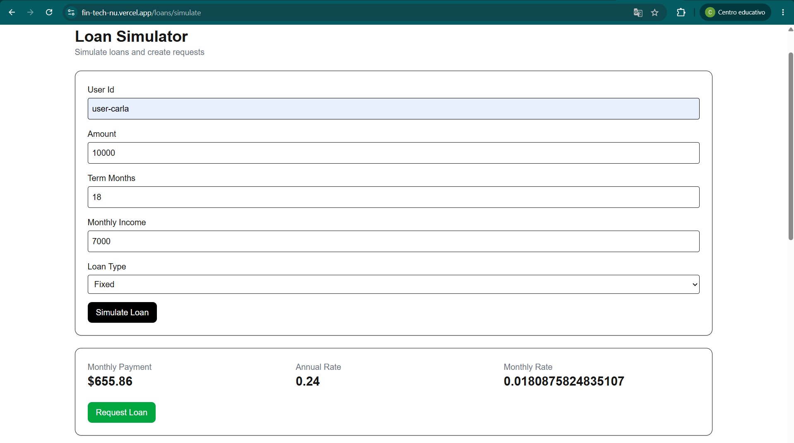
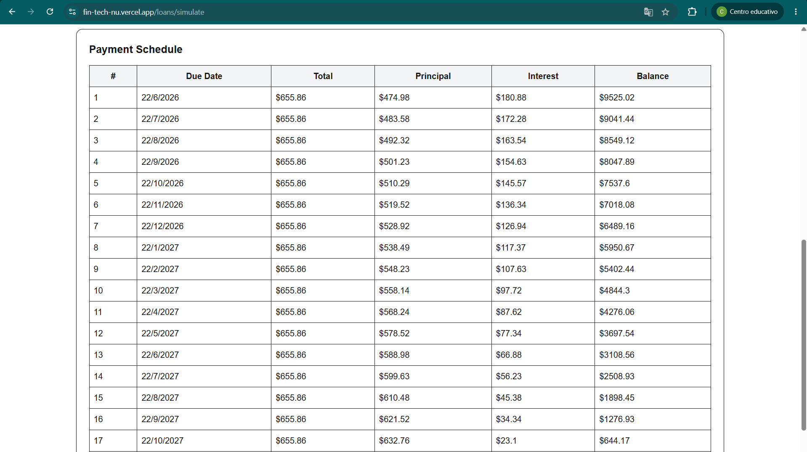
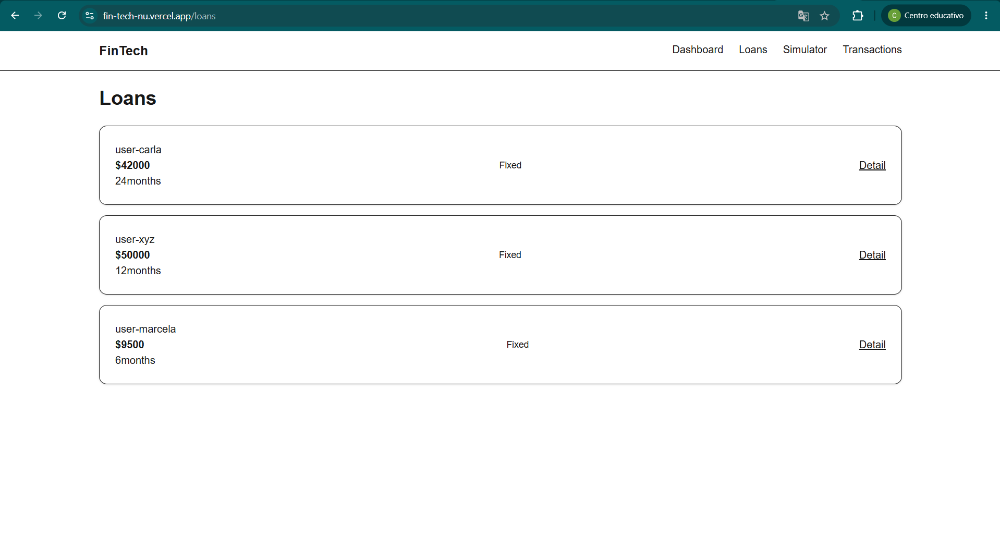
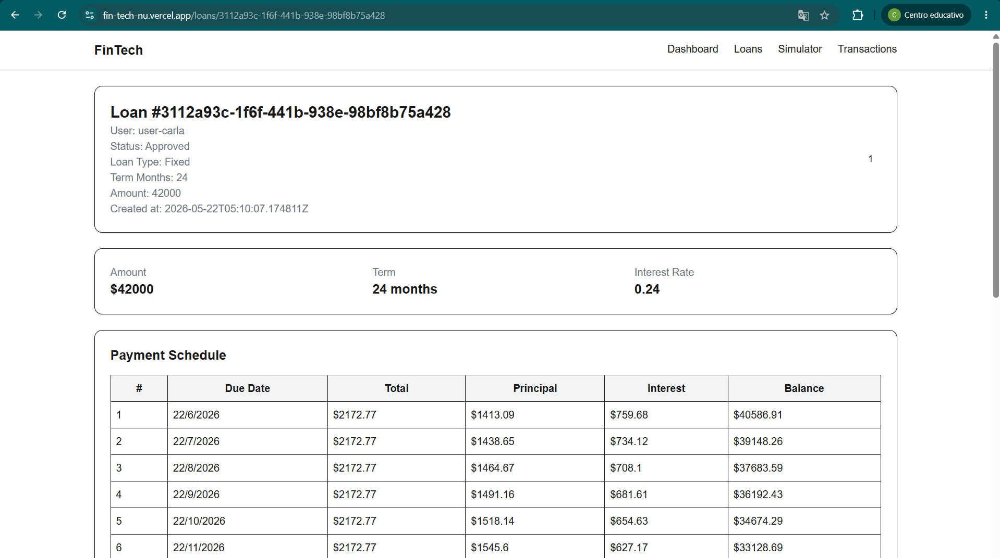
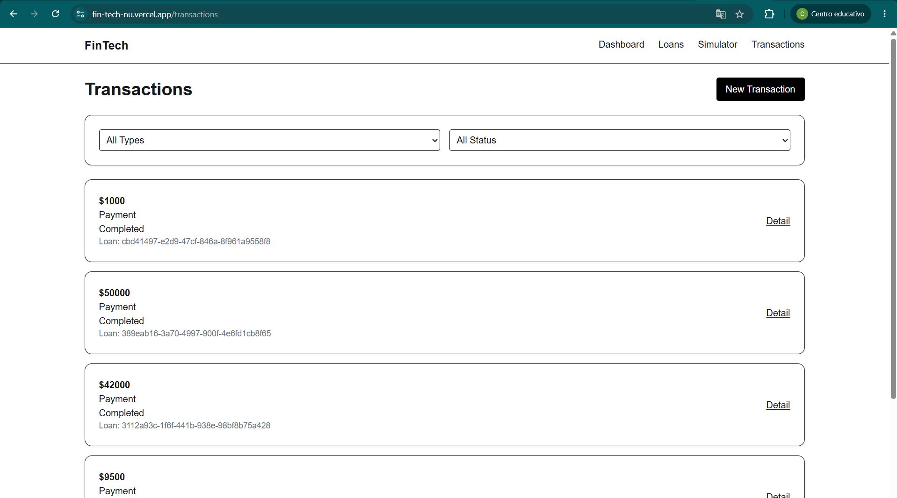
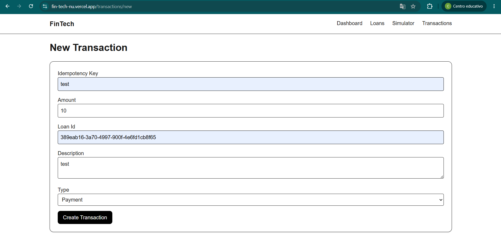
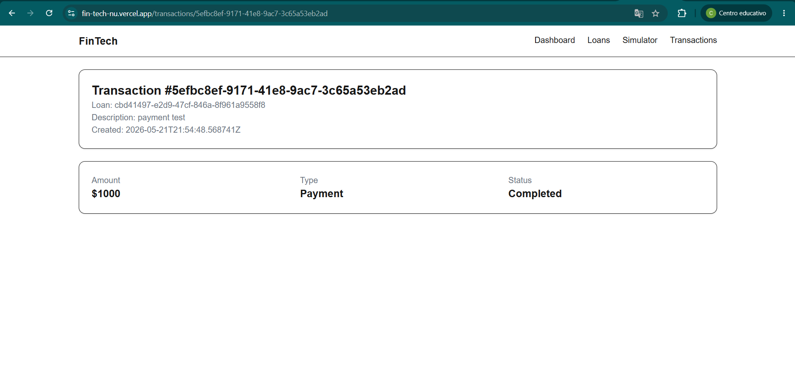

# SGIP - Sistema de Gestión de Inversiones y Préstamos

Sistema full-stack para la simulación, gestión y aprobación de préstamos

El proyecto permite:

- Simular préstamos con cálculo financiero en tiempo real
- Generar cronogramas de pagos usando el sistema francés
- Crear solicitudes de préstamo
- Gestionar estados de préstamos
- Procesar transacciones con idempotencia
- Visualizar préstamos y transacciones

---

# Demo

## Frontend

https://fin-tech-nu.vercel.app

## Backend (Swagger)

https://fintech-api-686f.onrender.com/swagger/index.html

---

# Screenshots

## Simulador de préstamos





## Lista de préstamos



## Detalles del prestamo


---

## Lista de Transactions



## Crear Transaction



## Detalles de la transaction



# Tecnologías Utilizadas

## Frontend

- TypeScript
- Next.js 14+
- React
- Tailwind CSS
- Axios
- React Hook Form
- Zod

## Backend

- .NET 8
- ASP.NET Core Web API
- Entity Framework Core
- PostgreSQL
- Swagger/OpenAPI
- xUnit
- Moq

---

# Arquitectura

El proyecto sigue una arquitectura en capas inspirada en Clean Architecture.

## Estructura Backend

```bash
FinTech.API/
├── Controllers/
├── DTOs/
├── Services/
│   ├── Interfaces/
│   ├── LoanService.cs
│   └── TransactionService.cs
├── Repositories/
│   ├── Interfaces/
│   └── Implementations/
├── Models/
├── Data/
├── Utils/
└── Tests/
```

## Estructura Frontend

```bash
src/
├── app/
├── components/
├── hooks/
├── services/
├── providers/
├── types/
└── lib/
```

## Design Patterns Implementados

1. Repository Pattern

Se implementó para desacoplar el acceso a datos y mejorar la mantenibilidad y testabilidad del sistema.

2. Dependency Injection

## Funcionalidades Implementadas

- Préstamos
- Simulación de préstamos
- Validación de monto y plazo
- Generación de cronograma de pagos
- Creación de solicitudes
- Listado de préstamos
- Detalle de préstamo
- Flujo de aprobación/rechazo
- Transacciones
- Creación de transacciones
- Idempotencia mediante IdempotencyKey
- Prevención de duplicados
- Listado de transacciones

## Fórmulas Financieras

```bash
TEA Fijo = 0.24
TEM = (1 + TEA)^(1/12) - 1
Sistema Francés (Cuota Fija)
Cuota = P * [i(1+i)^n] / [(1+i)^n - 1]

Donde:

P = monto del préstamo
i = tasa efectiva mensual
n = número de cuotas
```

## Reglas de Negocio
- Monto mínimo: $500
- Monto máximo: $50,000
- Plazo permitido: 6 - 60 meses
- Máximo 3 préstamos activos
- Las cuotas no pueden superar el 40% de ingresos mensuales
- Aprobación automática:
- Monto < $10,000
- Menos de 2 préstamos activos

## API Endpoints
Loans

- POST   /api/loans/simulate
- POST   /api/loans
- GET    /api/loans
- GET    /api/loans/{id}
- GET    /api/loans/{id}/schedule
- PATCH  /api/loans/{id}/approve
- PATCH  /api/loans/{id}/reject

Transactions

- POST   /api/transactions
- GET    /api/transactions
- GET    /api/transactions/{id}

## Instalación Local

Prerrequisitos

- .NET 8 SDK
- Node.js 18+
- PostgreSQL 14+

Backend

```bash
cd FinTech.API
dotnet restore

dotnet ef database update
dotnet run
```

El backend se ejecutará en:

```bash
http://localhost:7132
```

Swagger:

```bash
http://localhost:7132/swagger/index.html
```
Frontend

```bash
cd frontend
npm install
npm run dev
```

Frontend:

```bash
http://localhost:3000
```

## Variables de Entorno

Backend

```bash
DATABASE_URL=postgresql://...
ASPNETCORE_ENVIRONMENT=Production
```

Frontend

```bash
NEXT_PUBLIC_API_URL=http://localhost:5000
```

Testing

Ejecutar tests:

```bash
cd FinTech.Tests
dotnet test
```

## Decisiones Técnicas

- ¿Por qué Next.js?

Routing moderno con App Router
Excelente DX
Fácil despliegue en Vercel
Buen rendimiento

- ¿Por qué PostgreSQL?
Open source
Excelente integración con EF Core
Ideal para relaciones y constraints

- ¿Por qué Repository Pattern?
Separación de responsabilidades
Mejor testabilidad
Menor acoplamiento
Trade-offs y Simplificaciones

- Para priorizar tiempo y estabilidad:

Se implementó inicialmente solo cuota fija
Se utilizó un userId hardcodeado
No se implementó autenticación
Validaciones complejas se simplificaron parcialmente

- Mejoras Futuras

Autenticación JWT
Dashboard financiero
Docker Compose
CI/CD con GitHub Actions
Segundo tipo de préstamo
Paginación y filtros avanzados
Notificaciones en tiempo real
Seed Data
